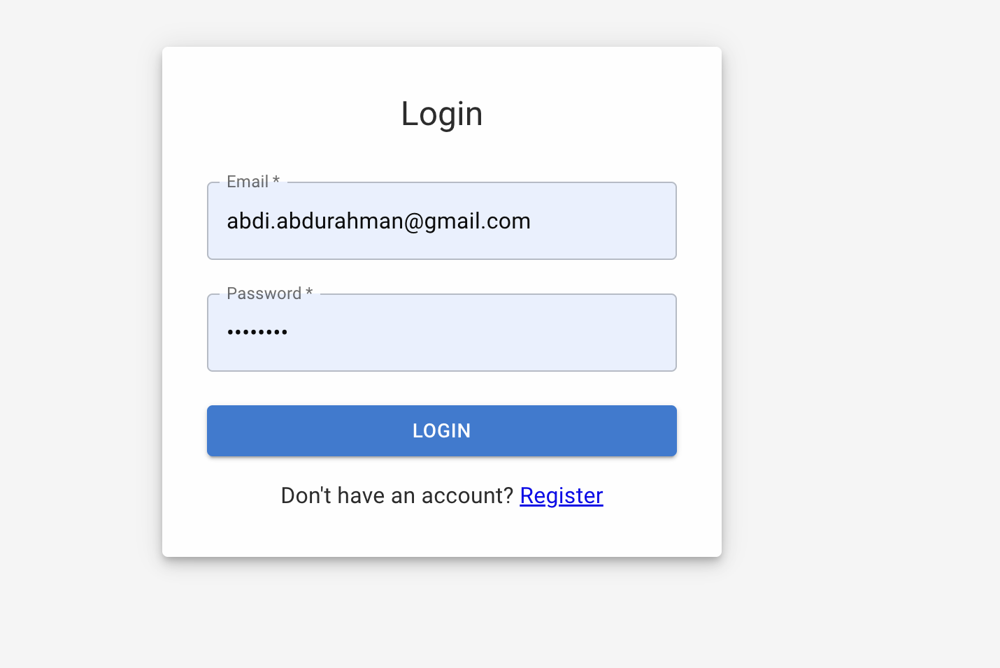
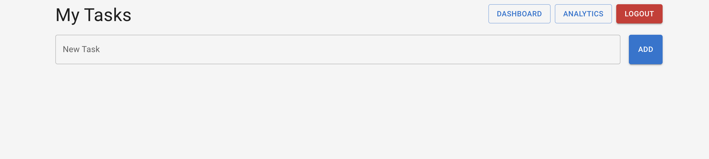
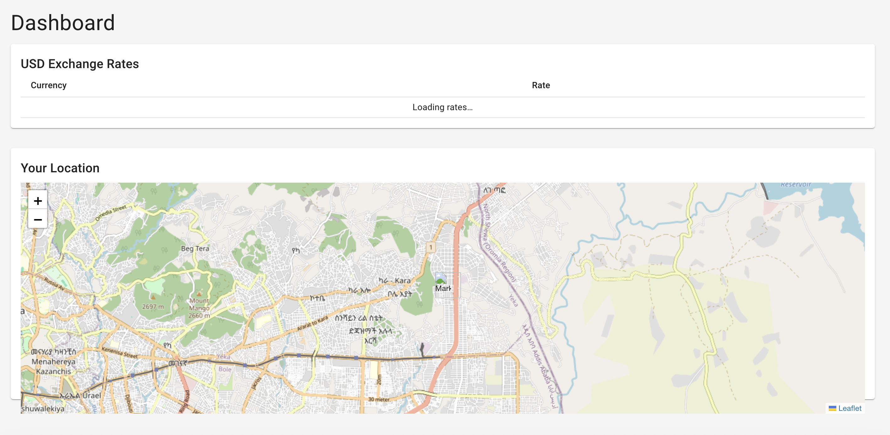

# Task Tracker App

A full-stack Task Tracking application built with **MERN stack** (MongoDB, Express.js, React, Node.js). It supports user authentication, task CRUD, and analytics dashboard. Ideal for personal productivity, portfolio demonstration, or learning full-stack development.


*Login page showing user authentication*


*Tasks page with task management UI*


*Analytics dashboard with exchange rates and map*

## Features

- User Authentication (JWT-based)
- Task Management (Add, View, Delete)
- Analytics Dashboard with data visualizations
- Location map integration (Leaflet)
- Fully Responsive Frontend using MUI
- Protected Routes with React Router
- Backend API with Express & MongoDB
- RESTful API architecture
- CORS secured communication
- Cookie-based session handling
- Modular folder structure

## Tech Stack

| Layer     | Technology |
|-----------|------------|
| Frontend  | React, MUI, Axios, React Router |
| Backend   | Node.js, Express.js, Mongoose, JWT |
| Database  | MongoDB |
| Dev Tools | Postman, VSCode, Git, npm, curl |

---

## Project Structure

```
/task-tracker
│
├── backend/
│   └── ... (controllers, middleware, models, routes)
/client/
│   └── ... (src, public, package.json)
└── README.md
```

---

## Getting Started

### Prerequisites

- Node.js & npm
- MongoDB installed and running
- Git

### Installation

```bash
# Clone the repository
git clone https://github.com/ABDURAHM4M/Task-Tracker.git
cd Task-Tracker

# Install backend dependencies
cd backend
npm install

# Install frontend dependencies
cd client
npm install
```

### Environment Variables

Create `.env` in `backend/`:

```
PORT=5001
MONGO_URI=mongodb://localhost:27017/tasktracker
JWT_SECRET=your_jwt_secret_here
CLIENT_URL=http://localhost:3000
```

Create `.env.local` in `client/`:

```
REACT_APP_API_URL=http://localhost:5000
```

### Running Locally

**Backend**
```
cd backend
npm run dev
```

**Frontend**
```
cd client
npm start
```

Visit `http://localhost:3000`

---

## API Endpoints

| Endpoint             | Method | Description         |
|----------------------|--------|---------------------|
| /api/v1/auth/login   | POST   | Login user          |
| /api/v1/auth/register| POST   | Register user       |
| /api/v1/tasks        | GET    | Get all tasks       |
| /api/v1/task/create  | POST   | Create a new task   |
| /api/v1/task/:id     | DELETE | Delete a task       |

---

## Deployment

- **Frontend:** GitHub Pages (automated via GitHub Actions)
- **Backend:** Render auto-deploy on GitHub push

---

## License

This project is **free to use** under the [MIT License](LICENSE).
